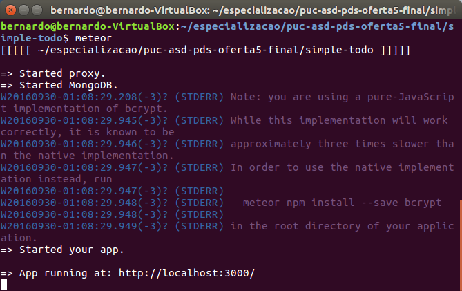
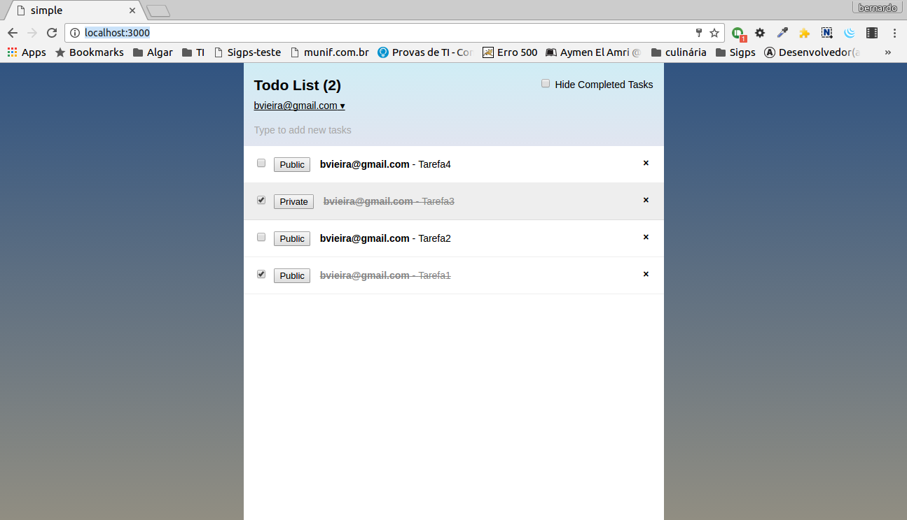
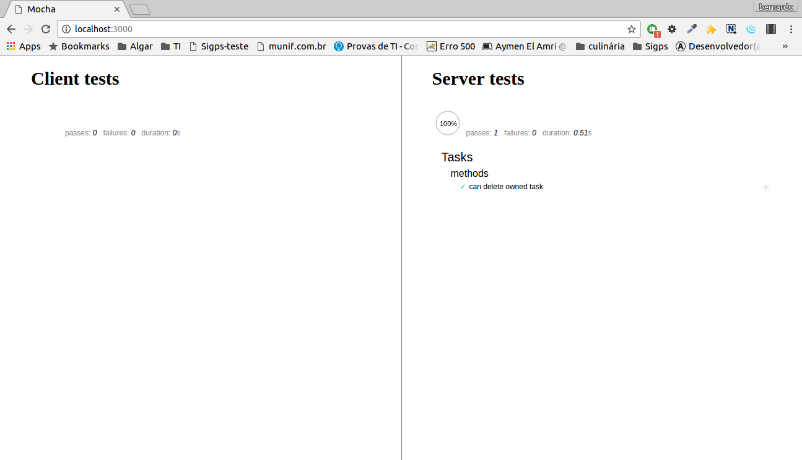

 
#Trabalho Final da disciplina Produtividade no Desenvolvimento de Software - Bernardo Guedes Vieira.
# 
##Meteor
[Meteor](https://www.meteor.com/) é um *framework* para desenvolvimento de aplicações Web JavaScript *full-stack*, com um grande foco em produtividade e Tempo real. Hoje na versão 1.4, meteor foi lançado em 2012.

Em todo o framework, somente JavaScript é utilziada. Isso significa que, na pilha arquitetural, cliente, servidor e banco de dados usam respectivamente JavaScript, Node.js e MongoDB nativamente. Está no *roadmap* o acesso nativo ao Mysql. Entretanto, quando necessário, existem pacotes [*3rd-party* que fornecem suporte para acessar os SGBDS MySql](https://github.com/numtel/meteor-mysql)  e [PostgreSQL](https://github.com/numtel/meteor-pg). 

Por *default*, toda aplicação desenvolvida utilizando o framework em questão é do formato *Single Page Application* (SPA) e tem como estilo arquitetural predominante Model-View-ViewModel (MVVM).

Como já foi dito anteriormente, o back-end de uma aplicação Meteor é suportado pelo Node.js. Assim como o NPM no Node executa a tarefa de gerenciamento de pacotes, no Meteor esta tarefa fica a cargo do Atmosphere. 

### Princípios do Meteor
Meteor foi construído com 7 princípios que estão listados a seguir: 
   - **One Language:** como já foi citado, o JavaScript é utilizado Verticalmente, sendo a linguagem utilizada tanto no cliente quanto no servidor (incluíndo banco de dados). Horizontalmente, o mesmo código escrito para aplicações web tradicionais é utilizado para aplicações *mobile*. 
    - **Database anywhere:** o acesso ao banco de dados ocorrer através de uma API única e tranparente, permitindo que operações sejam executadas da mesma forma tanto a partir do cleinte quanto do servidor.
    - **Latency Compensation:** No cliente é usado prefetching e model simulation na API do banco de dados para atingir latência zero no acesso de seus recursos.
    - **Full-Stack Reactivity:** Todas as camadas da aplicação são orientadas à eventos. Característica herdada do Node.js que dá às aplicações desenvolvidas a condição de Tempo Real. Isto significa que eventos que ocorrem no contexto da apliação são percebidos pelos usuários de forma quase instantânea. Exemplo é um comentário é adicionado a uma foto. Não é necessário que o uma a tela seja refrescada para que as pessoas que estão visualizando a foto tomem conhecimento desse comentário. Ele simplismente é adicionado na visão do usuário.
    - **Data on the wire:** HTML não é enviado pela rede. Somente dados trafegam e o cliente decide como e quando irá tratar e apresentar tal informação.
    - **Embrace the ecosystem:** Totalmente *open-source*, possui convenções pelas quais agrega valores, em vez de ser uma ferramenta que irá substituir outros *frameworks*.
    - **Simplicity equals Productivity:** Seja produtivo! Desenvolva  features de forma rápida e simplificada. O Meteor mantém um conjunto de APIs fáceis de implementar e a comunidade Meteor está sempre framework.
    
### Bases do framework

Abaixo temos algumas tecnologias e implementações que são a base do framework Meteor:

   - SockJS — framework emulador de WebSockets e responsável pelo funcionamento do protocolo DDP ( Data Distribution Protocol ).
   - MongoDB — banco de dados default. 
   - Handlebars — template engine.    
   - PubSub — biblioteca de emissão e escuta de eventos via pattern: publisher / subscriber . 
   - MiniMongo — API client-side que possui a maioria das funcionalidades do MongoDB. 
   - Connect — módulo Node.js com funcionalidades para trabalhar com protocolo HTTP.
    
    

###Características importantes 
####Publish/Subscribe

Em aplicações web, a forma mais comum de comunicação entre cliente e servidor é do tipo *Request-Response*, onde uma url é acessada pelo cliente, solicitando algum recurso provido pelo servidor. Esta requisição é processada e uma resposta contendo as informações desejadas são retornadas, tipicamente nos formatos HTML, JSon ou XML. O Servidor nunca coloca diretamente informações no cliente quando algum evento altera o conteúdo no back-end. 

No Meteor, o fluxo de informação é bi-direcional, não sendo necessário por exemplo que *endpoints* REST sejam acessados para que a percepção do usuário seja modificada. São criados *endpoints* do tipo ***Publication*** que possuem a capacidade de enviar dados aos clientes. Os clientes por sua vez conectam-se à esses *endpoints*. À esta conexão do cliente com o servidor damos o nome de ***Subscription***. 

Podemos descrever este processo como sendo uma ponte entre uma Coleção do MongoDB e sua representação armazenada no cliente (Minimongo) em uma espécie de cache. O objetivo desta ponte é manter os dados sempre atualizados no cliente com sua última versão do servidor.  

#### Camada de Visão

Meteor possui suporte para três bibliotecas de interface: [Blaze](https://guide.meteor.com/blaze.html), [React](https://guide.meteor.com/react.html)  e [Angulalr](http://www.angular-meteor.com/) . Blaze foi inicialmente criada juntamente com o *framework*. Entretanto, React lançada em 2011 pelo Facebook e Angular em 2013 pelo Google possuem maiores comunidades e consequentemente um desenvolvimento mais intenso. 

   - **Blaze:** utiliza sintaxe no estilo Handlebars. Lógicas podem ser adicionadas como por exemplo {{#if}} e {{#each}} diretamente no HTML. 
   - **React** utiliza [JSX](https://facebook.github.io/react/docs/jsx-in-depth.html) para definição da interface. JSX é uma extensão da sintaxe JavaScript semelhante ao XML. Abaixo temos um exemplo<pre> <code>
   var App = (
   &lt;Form&gt;
    &lt;FormRow&gt;
      &lt;FormLabel/&gt;
      &lt;FormInput/&gt;
    &lt;/FormRow&gt;
  &lt;/Form&gt;
);
</code></pre>
   - **Angular** utiliza HTML com [atributos especiais](https://angular.io/docs/ts/latest/guide/cheatsheet.html)  para lógica e eventos. Template helpers são escritos em JavaScript

React e Angular impõe uma estrutura que facilita o desenvolvimento de grandes aplicações. Entretanto, se as [convenções](https://guide.meteor.com/blaze.html#reusable-components)  estipuladas para o Blaze foram seguidas, uma estrutura também pode ser criada. 

#### Segurança

Meteor inclui em sua estrutura uma separação entre código e dado, cliente e servidor, conexões com representação de estado que devem ser autenticadas explicitamente e regras para permitir ou negar o acesso a operações do banco de dados.

MongoDB é por sua natureza mais resistente contra injeções de código que bancos de dados SQL porque não analisa entradas, mas ainda há coisas para estar atento. Um exemplo é expressões passadas onde eram esperados strings.

Meteor utiliza a melhor criptografia para armazenar senhas hash - [bcrypt](http://codahale.com/how-to-safely-store-a-password/).

#### Assistente

Meteor possui um assistente que de uma maneira parecida com o [Yeoman](http://yeoman.io/) auxilia em scaffolding. 

Para criar nova aplicação
<pre><code>meteor create nome-minha-app</code></pre>

Para adicionar o bootstrap no projeto basta executar o código abaixo:
 
<pre><code>meteor add mrt:bootstrap-3</code></pre>

O código abaixo inclui por completo a funcionalidade de login utilizando Usuário e senha aramazenados localmente:

<pre><code>meteor add accounts-ui accounts-password</code></pre>

#### Escalabilidade

Normalmente, escalabiliade é resolvida em aplicações web utilizando-se um balanceador de carga como NGINX, ou Apache MOD-JK. Entretanto, em aplicações de tempo real provido pelo modelo de comunicação Publish/Subscribe existem alguns outros desafios. Abaixo algumas estratégias para promover escalabilidade de aplicações Meteor.

   - Websocket atrás de HaProxy e Nginx. Lembrando sempre de ativar a opção  *Sticky Sessions*  sob pena de carregar desnecessariamente dados. 
   - Mongo Oplog: nesta opção o servidor meteor funciona como uma réplica do Mongo.
   - O protocolo DDP (Distributed Data Processing)
   - O pacote [Meteor Cluster](https://meteorhacks.com/cluster-a-different-kind-of-load-balancer-for-meteor.html) transforma a aplicação executando em cada um dos nós em um balanceador de carga. Novas instâncias, rotas, carga é gerenciada automaticamente pelo pacote sem que seja necessário reiniciar o cluster ou Balanceador para retirar, adicionar ou configurar rota ou carga de um nó.
   
#### Testes

Testar uma aplicação Meteor não é diferente de testar qualquer outro tipo de aplicação JavaScript full-stack. Entretanto existem dois pontos que devem ser observados particularmente no caso de aplicações Meteor:

   - Reatividade - inputs no sistema devem gerar mudanças na visão de um cliente que provavemente não foi o responsável por exercitar o sistema. Para suportar esta característica, existem algumas formas de esperar pelas atualizações. Por exemplo o comando Tracker.afterFlush().
   - Dados em Cliente/Servidor - O sistema de dados utilizado no Meteor propicia uma grande integração entre cliente e servidor. Entretanto dificulta a execução de testes de maneira unitária, sem que haja integração entre diversos componentes. Discussões sobre esta questão podem ser encontradas [aqui](https://guide.meteor.com/testing.html#test-modes), [aqui](https://guide.meteor.com/testing.html#full-app-integration-test)  ou [aqui](https://guide.meteor.com/testing.html#generating-test-data).  
   
### Caso real de uso da tecnologia

#### Mazda Car Configurator
Url: [http://configurator.mazda.nl/](http://configurator.mazda.nl/) 

O configurador de carros acessado a partir do sítio da montadora foi o primeiro a combinar conteúdo stático de publicidade com grande variedade de informações técnicas e características do modelo que podem ser escolhidas. Na verdade todo o site é o configurador. Ao contrário do que é usual na indústria automotiva, onde o configurador é uma pequena porção do portal, 

Neste link ([http://info.meteor.com/blog/mazda-configurator-q42-meteor-react](http://info.meteor.com/blog/mazda-configurator-q42-meteor-react) ) podemos acessar o estudo de caso. 

No site do Meteor também encontramos um [*Showcase*](https://www.meteor.com/showcase)  de diversos casos onde foi utilizado o framework para construção de alguma aplicação. 

### Material para estudo: 

#### Livros:

 - [Criando aplicações web real-time com JavaScript](https://www.casadocodigo.com.br/products/livro-meteor) 
 - [Mastering MeteorJS Application Development](https://www.packtpub.com/web-development/mastering-meteorjs-application-development) 
 - [The Meteor Testing Manual](http://www.meteortesting.com/) 
 - [Meteor Cookbook](http://meteorgitbook.harp.io/) 
 - [Meteor in Action](http://www.meteorinaction.com/) 
 
#### Sites:

   - http://www.meteor.com
   - [https://forums.meteor.com/](https://forums.meteor.com/) 

#### Cursos
   
   - [Meteor and React for Realtime Apps](https://www.udemy.com/meteor-react-tutorial/) 
   - [Intermediate Meteor](https://www.youtube.com/playlist?list=PLLnpHn493BHFYZUSK62aVycgcAouqBt7V)
   - [Introducion to Meteor.js Development](https://www.coursera.org/learn/meteor-development)
   
## Aplicação Simple Todo

Para executar a aplicação, dentro do diretório do código executar o comando: 

<pre><code>/diretorio/da/aplicacao/simple-todo/ meteor</code></pre>

 

Para executar em modo de testes, utilziar o comando abaixo dentro do diretório da aplicação: 

<pre><code>meteor test --driver-package practicalmeteor:mocha</code></pre>

Amostra do relatório de testes gerado pelo Mocha quando executado o comando acima

