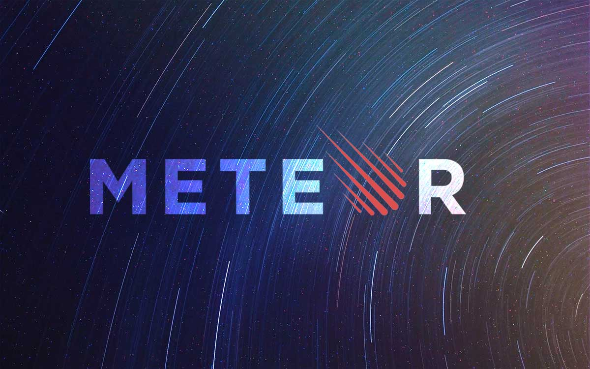

 
#Trabalho Final da disciplina Produtividade no Desenvolvimento de Software - Bernardo Guedes Vieira.
# 
##Meteor
Meteor é um fremawork para desenvolvimento de aplicações web JavaScript *full-stack* . Isto significa, que todas as camadas de aplicações desenvolvidas utilizando Meteor serão escritas em JavaScript. 

Isso significa que na pilha arquitetural, cliente, servidor e banco de dados usam respectivamente JavaScript, Node.js e MongoDB.

Por *default*, toda aplicação desenvolvida utilizando o framework em questão é do formato *Single Page Application* e tem como estilo arquitetural predominante MVVM.